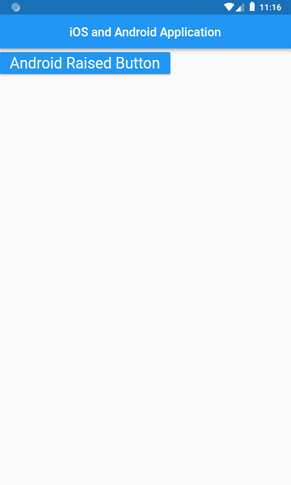
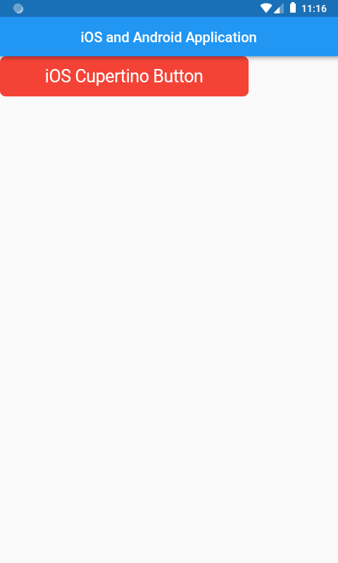

# flutterandroidios

A new Flutter application that use the iOS and Android Widget

## Getting Started

This project is a starting point for a Flutter application.

A few resources to get you started if this is your first Flutter project:

## Android interface :

## iOS interface :

